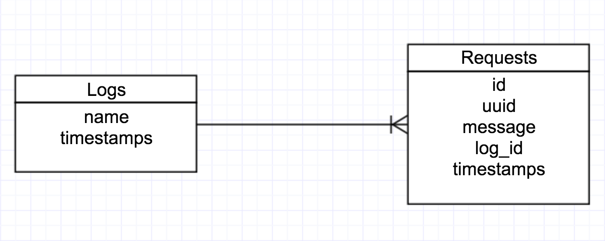

# NewlyWish Challenge

This is a tentative solution to the problem provided [here](./INSTRUCTIONS.md).

The goal was to create an admin dashboard to search through server logs of rails applications to measure browsing patterns and debug.

## Setup

Prerequisites(in order):

- [Github](https://www.github.com)
- [Ruby v2.2+](https://www.ruby-lang.org/en/documentation/installation/) (Ruby Version Manager Suggested)
- [Bundler](http://bundler.io/)
- [Rails](http://installrails.com/)
- [MySql](http://brewformulas.org/Mysql)

Ruby and it's library manager, Bundler need to be installed prior to installing Rails.
MySQL should be running in order for Rails to work.

Simply clone this repository, or [view online here](https://nameless-beach-46209.herokuapp.com/)

After cloning, open your terminal, *navigate to the rails app folder*,run the following commands:

1. bundle exec bundle install
1. bundle exec rake db:create
1. bundle exec rake db:migrate

After the above commands, run:

1. rails s
1. navigate to `localhost:3000` in your web browser
1. hit `ctrl-c` to close the app

## The Approach

With an 8 hour time limit I didn't have a lot of time to get every feature created. I had to get back into code writing mode, and set up mysql. Many features are missing, but the experience was helpful to me.

I wanted to start with just monitoring the log of the current Rails app I was writing, before expanding to analyzing logs from other apps. I knew based on the `sample.log` file that I'd have to sign each server request with the UUID, and the bulk of my time would be spent parsing through said file.

I began by researching different ways to customize my rails log to get the UUID in there and came across [this tutorial](https://wearestac.com/blog/log-tagging-in-rails).
The next challenge was actually parsing the file. I began by going into `pry` to test out how to parse the file and the text to create an object with UUIDs and corresponding messages. There's some gross regexes in there, but nothing too crazy.

Then I set about displaying the logs just on a static page.

I started setting up ways for the code to work in production on heroku, which introduced some issues I'd have to address later.

After the initial code started working I refactored it, placing code where it made sense to me. The goal for my refactor was to make this as painless as possible to integrate into a live application. This is why there's an empty welcome_controller.

My file parser grabs the `/log/development.log` file, though it is dynamic based on the environment the application is running in. Since it formats the logs for my view, I have it placed in the `log_helper.rb`. You're welcome to paste your `sample.log` data in the `development.log` file to see how it works with these files.

The admin page displays on the root page for simplicity, however the `log_controller` that manages it is actually nested in an `admin` namespace. If you were to lock the routes down and implement CRUD actions they'd be easy to place.

You can check out the `/admin/logs/index` which is where you'd ideally hit it in a live setting. To test what my production settings looked like I set up a `/admin/logs/raw/:env` route to show the raw text from the log files across environments.

On the front end, I considered making this an angular SPA, so a json format option was added to the index route just for kicks, but time became an issue and at this point I had to stop. The best I got was formatting each message based on detected error codes. You can trigger them in production by hitting a route that doesnt exist. It should display in a light red.

The last things I added were the migrations to manage logs and the requests in them. They had the following structure:

My thinking was if this was an app that could manage the logs of many applications I'd have different logs that had many requests inside them. The logs themselves could also belong to individual apps, but I wanted the above relationship working locally before scaling. The models aren't yet linked with ActiveRecord but it's a basic relationship.

Looking back a lot of my time was burnt doing research but I want to give an accurate picture of where I'm at right now. I can display the logs, and implementing searches would be a simple implementation of keyword matches + string searches (moreso if i could preformat the data). I think this was a really cool and challenging task.

## Things I'd Add

- Users: Obviously I'd want to lock down my admin routes and log controllers for only authorized users, I just sidestepped the issue for time.
- Graph views of the top routes, response times, and errors
- HandRolled logs to more easilly structure log data by date, response status, flag errors, etc
- Search: if structured, the filtering could be handled by the model, if not by some text searching or angular directives.
- CRUD system for logs, so you could upload your own logs for analysis
- The app looks terrible, i'd spruce up the view with it's own admin layout for easier navigation

## Thanks!

I'm sorry my app is so bare bones, I've had to context switch back from only solving general MEAN stack problems. I don't believe I've met the requirements of the challenge by any means, but I definitely enjoyed the practice. With a little more time I'd definitely speed up by a lot, but however this pans out, thanks so much for the oppurtunity!

